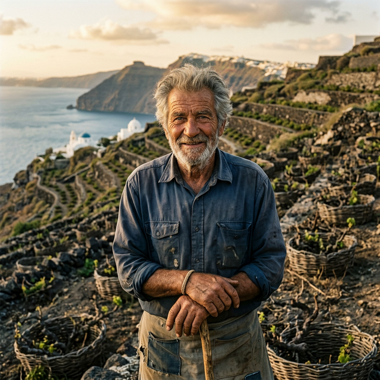

# Voices of Santorini — Whispers of the Caldera

A mobile-first web application mapping the oral histories and local voices of Santorini island. A digital cultural memory layer that gathers the fading echoes of island life — the textures of volcanic soil, the resilience of the locals, and the stories that postcards never tell.



## Overview

**Voices of Santorini** is an interactive storytelling experience that connects users with real people of Santorini through their words, their places, and their trades. The app presents 7 narrative portraits — from Assyrtiko farmers to sea captains — each anchored to a specific location on the island and brought to life through editorial photography, long-form narrative, and an interactive map.

### Key Features

- **🏠 Home Screen** — Cinematic hero with animated volcanic particles, entry points to Map and Story Library, featured stories carousel
- **🗺️ Interactive Map** — Full-screen Leaflet.js map of Santorini with dark CartoDB tiles and custom vine-green markers. Tap a marker to preview a story in a bottom-sheet overlay
- **📚 Story Library** — Filterable archive of all voices. Filter by category: Farmers, Artisans, Food Traditions, Sea & Harbor
- **📖 Story Detail** — Full editorial page with portrait hero, simulated audio player, biographical info, long-form narrative, location mini-map, and related stories
- **🧭 SPA Navigation** — Hash-based routing with smooth view transitions and a persistent bottom navigation bar

### Visual Identity

| Token | Value | Usage |
|-------|-------|-------|
| Volcanic Black | `#1A1A1A` | App background |
| Volcanic Dark | `#2B2B2B` | Card/surface background |
| Warm Stone | `#E8E3DD` | Primary text |
| Vine Green | `#4F6D58` | Accent, markers, active states |
| Font (Primary) | Work Sans | Body text, UI |
| Font (Display) | Playfair Display | Headlines, quotes |

## Tech Stack

| Layer | Technology |
|-------|-----------|
| Structure | Semantic HTML5 |
| Styling | Vanilla CSS (50+ custom properties) |
| Logic | Vanilla JavaScript (ES6+, IIFE module) |
| Map | Leaflet.js 1.9.4 + CartoDB Dark Tiles |
| Icons | Google Material Symbols |
| Fonts | Google Fonts (Work Sans, Playfair Display) |
| Server | Any static file server (e.g. `npx serve`) |

**No build step required.** No frameworks, no bundlers, no transpilers. Pure HTML/CSS/JS served as-is.

## Getting Started

### Prerequisites
- Node.js (for `npx serve`) or any static HTTP server
- A modern browser (Chrome, Firefox, Edge, Safari)

### Installation & Run

```bash
# Clone or navigate to the project
cd voices-of-santorini

# Start a local server
npx -y serve -l 3000

# Open in browser
# → http://localhost:3000
```

The app loads instantly — no install, no build.

## Project Structure

```
voices-of-santorini/
├── index.html          # SPA shell with 4 view containers
├── styles.css          # Complete design system
├── app.js              # Application logic (routing, map, filters, audio)
├── data/
│   └── stories.json    # Centralized story data (7 entries)
├── images/
│   ├── yannis.webp     # Assyrtiko Farmer, Megalochori
│   ├── nikos.webp      # Village Baker, Emporio
│   ├── eleni.webp      # Master Weaver, Pyrgos
│   ├── yorgos.webp     # Vintner, Oia
│   ├── sophia.webp     # Ceramicist, Akrotiri
│   ├── dimitris.webp   # Sea Captain, Ammoudi
│   └── maria.webp      # Tomato Farmer, Megalochori
└── README.md
```

## Data Model

Each story in `stories.json` contains:

```json
{
  "id": "yannis",
  "name": "Yannis",
  "role": "Assyrtiko Farmer",
  "location": "Megalochori",
  "category": "Farmers",
  "quote": "Volcanic soil teaches patience...",
  "fullStory": "Long-form narrative text...",
  "lat": 36.3756,
  "lng": 25.4316,
  "portrait": "images/yannis.webp",
  "audioDuration": "2:23"
}
```

### Story Categories
- **Farmers** — Yannis (Assyrtiko), Yorgos (Vintner)
- **Artisans** — Eleni (Weaver), Sophia (Ceramicist)
- **Food Traditions** — Nikos (Baker), Maria (Tomato Farmer)
- **Sea & Harbor** — Dimitris (Sea Captain)

## Architecture

```
User ──► index.html (SPA shell)
              │
              ├── styles.css (design tokens + components)
              ├── app.js (IIFE module)
              │     ├── Router (hash-based #home/#map/#library/#story/:id)
              │     ├── Data Loader (fetch + cache stories.json)
              │     ├── View Renderers (home, map, library, detail)
              │     ├── Leaflet Map Manager
              │     └── Audio Simulation
              └── data/stories.json (static data source)
```

- **Routing:** Hash-based (`window.hashchange`), no server-side routing needed
- **State:** In-memory JavaScript variables (stories array, current view, map state)
- **Rendering:** Template literals injected via `innerHTML` for each view

## Design Decisions

1. **No framework** — Chosen for simplicity, zero build step, and maximum portability. The app is small enough that vanilla JS provides clarity without framework overhead.
2. **Dark volcanic theme** — Matches the Stitch PRD aesthetic and creates an immersive, documentary atmosphere appropriate for the cultural subject matter.
3. **Leaflet.js** — Lightweight, mobile-friendly map library. CartoDB dark tiles match the app theme seamlessly.
4. **Simulated audio** — The audio player UI simulates playback (progress bar + timer) since actual audio files are not yet available. Real audio can be plugged in by replacing the simulation with `<audio>` element controls.
5. **Generated portraits** — AI-generated editorial photography provides realistic placeholder imagery that matches the documentary aesthetic.

## Accessibility

- Semantic HTML5 elements (`<nav>`, `<section>`, `<article>`, `<blockquote>`)
- `alt` text on all images
- Screen-reader-only utility class (`.sr-only`)
- `prefers-reduced-motion` media query disables animations
- High contrast text (warm stone on volcanic dark)
- Material Icons with text labels

## License

This project is a prototype/portfolio piece. Story content is fictional and created for demonstration purposes.

---

*Built with ❤️ from the caldera — Voices of Santorini, 2026*
